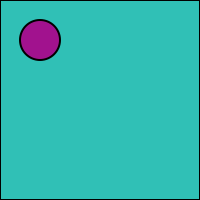

# Daily Practice

Will try and follow Noah Gibbs Conscious Coding Practice and see what happens.

## Cycle 02

### Week 03

### Week 02

### Week 01

## Cycle 01

### Week 03
 - https://bulany.github.io/daily-practice/cycle01/week03day01.html
 - https://bulany.github.io/daily-practice/cycle01/week03day02.html
 - https://bulany.github.io/daily-practice/cycle01/week03day03.html
 - https://bulany.github.io/daily-practice/cycle01/week03day04.html
 - https://bulany.github.io/daily-practice/cycle01/week03day05.html
 - https://bulany.github.io/daily-practice/cycle01/week03day06.html
 - https://bulany.github.io/daily-practice/cycle01/week03day07.html

### Week 02
 - https://bulany.github.io/daily-practice/cycle01/day01week02.html
 - https://bulany.github.io/daily-practice/cycle01/day02week02.html
 - https://bulany.github.io/daily-practice/cycle01/day03week02.html
 - https://bulany.github.io/daily-practice/cycle01/day04week02.html
 - https://bulany.github.io/daily-practice/cycle01/day05week02.html 
 - https://bulany.github.io/daily-practice/cycle01/day06week02.html 
 - https://bulany.github.io/daily-practice/cycle01/day07week02.html 
  
### Week 01
 - https://bulany.github.io/daily-practice/cycle01/day01week01.html
 - https://bulany.github.io/daily-practice/cycle01/day02week01.html
 - https://bulany.github.io/daily-practice/cycle01/day03week01.html
 - https://bulany.github.io/daily-practice/cycle01/day04week01.html
 - https://bulany.github.io/daily-practice/cycle01/day05week01.html
 - https://bulany.github.io/daily-practice/cycle01/day06week01.html
 - https://bulany.github.io/daily-practice/cycle01/day07week01.html